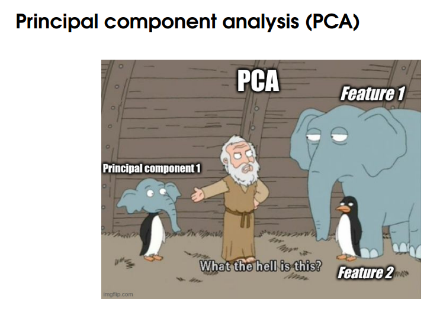
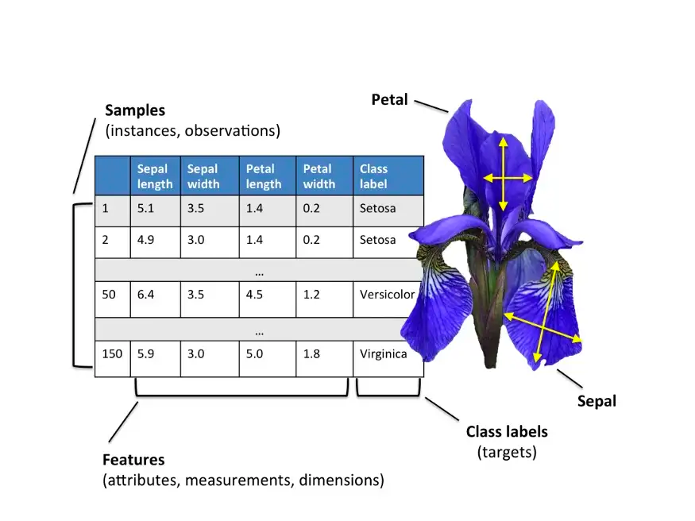

# Tutorial on Principal Componenet analysis
(Suparno Bhattacharyya, Texas A&M University)

Check out the jupyter notebook.

### Case studies with visual explanation

<video controls src="media_files/SpringMassOscillation3D.mp4" title="Title"></video>
<video controls src="media_files/Media1-1.mp4" title="Title"></video>
